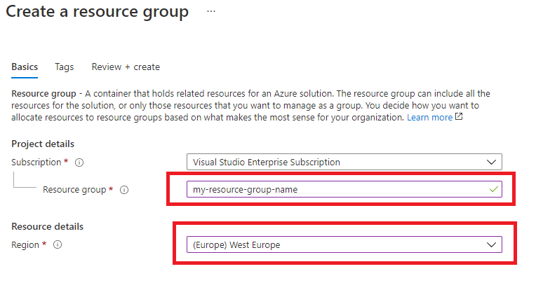
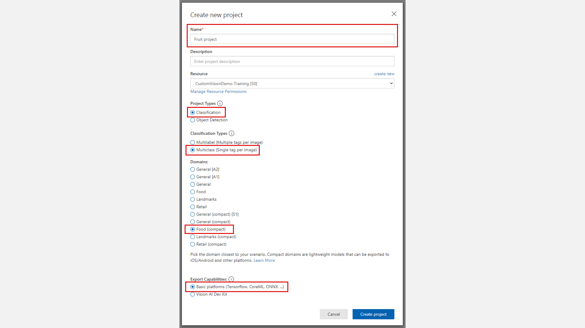
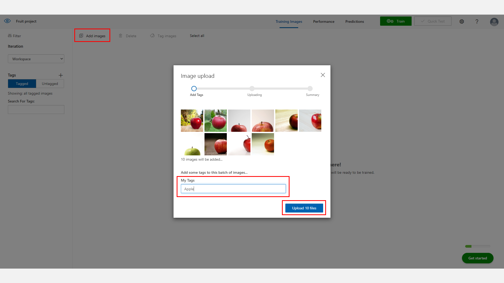
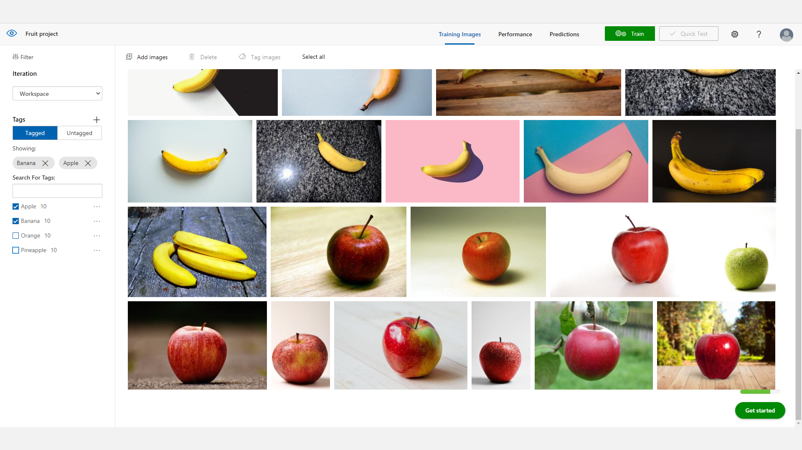
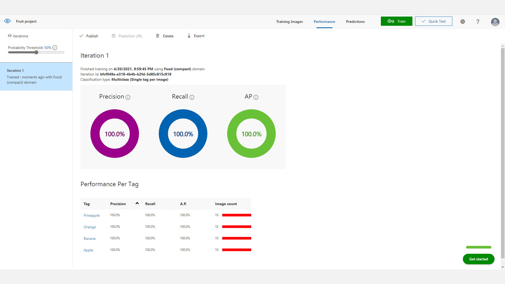
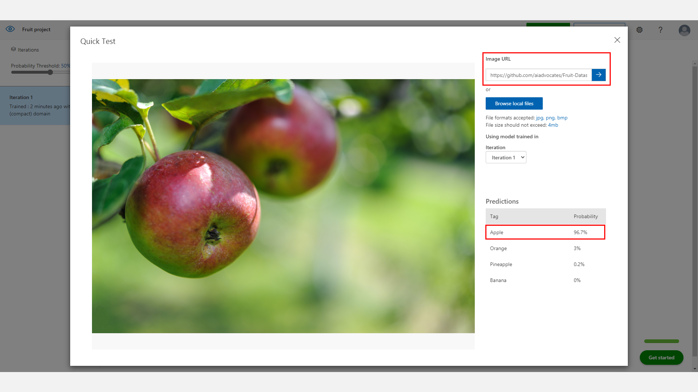
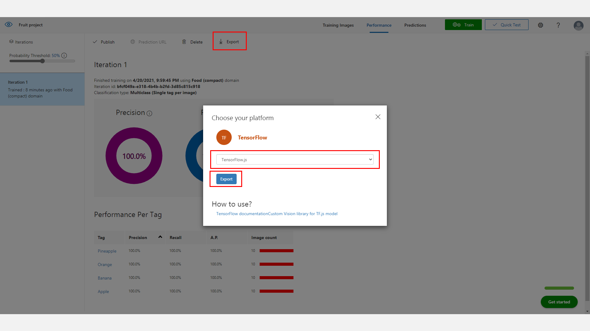
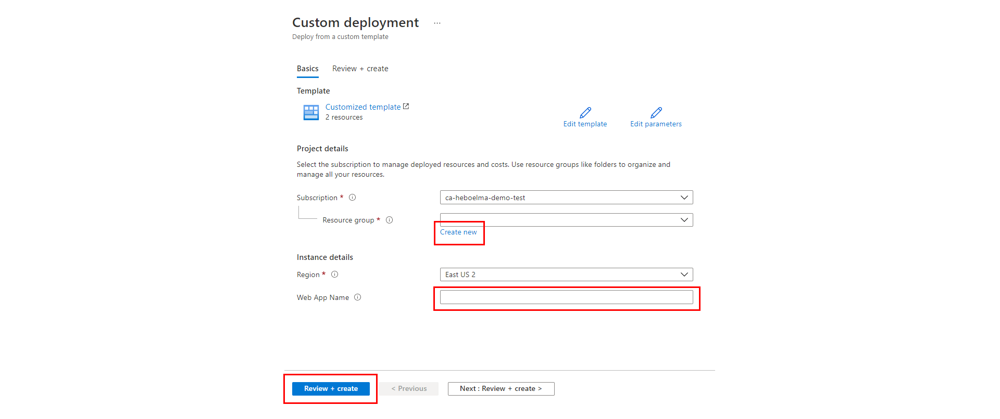
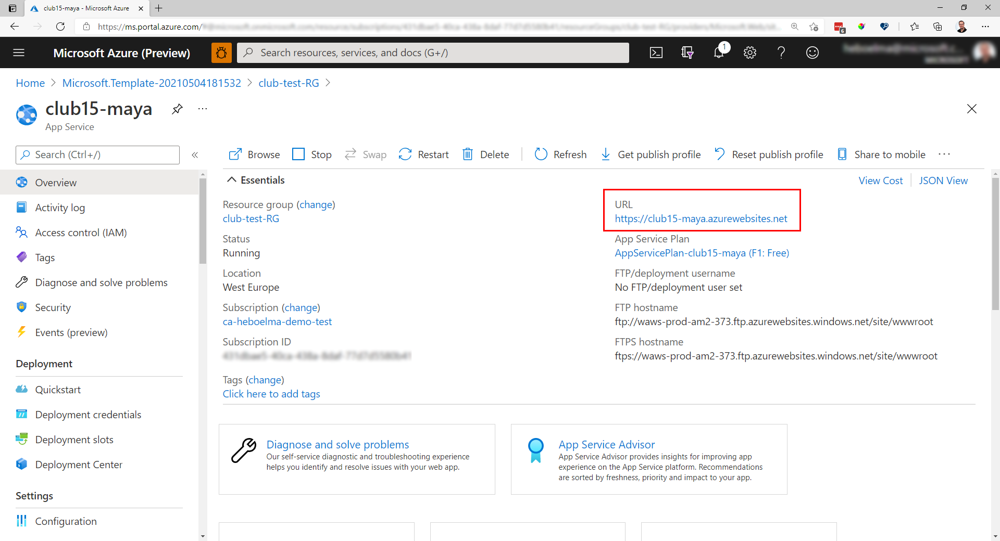
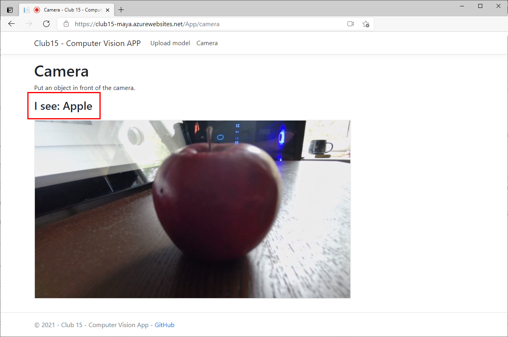

# Custom Vision - Workshop

Hi everyone and welcome!
In this tutorial you are going to create a Machine Learning model that can identify an object that you hold in front of a camera.

# Background Concept 
Before we get started, let's learn about "why" you would do this in the first place.
The short answer is, using machine learning teaches the camera to "see." It doesn’t really see but the model inside of it makes it intelligent and can detect objects it is looking for.

# Let’s walk through an example that you will learn how to build in this lab using fruit.
The camera is pointing at some fruit.  
Without any machine learning on your camera, you will just see a video recording of fruit.  
**How does anyone learn anything?**  
Think of when you were young before you could read. 
These are the steps you used to learn:
* You would be shown a flash card with a picture on it or you were given an object to feel.   
* The object was an Apple. 
* Next to the picture was written the word “Apple” or it was written in braille for you. 
 
**This** is how you learned to connect the word to the object in the picture. 

Teaching a computer to know what an apple is **works the same way**.   

You show it a lot of pictures and tell it those are apples.  Then, to put it simply, it makes a little program that you can install on your camera.  Once you do, if your camera could talk, it would say, “I am now smart enough to know when I see an apple come into view.”
That is called *“training the model.”*  In this lab you will “train the model” to identify fruit.

# From Apples to Elephants
Once you complete the steps in this lab, which uses fruit as an example, there is conceptually no difference between whether you taught the computer so know apples, oranges, cats, or elephants. 
Like learning to ride a bike.  
Once you know the basics, you can ride all sorts of different bikes using the same concepts of pedaling, balancing, steering, and ringing a bell to make sure people know you are coming their way. 
Just takes some practice and in no time, you are on your way!

# How do Camera Traps work?
They work the same way!  
The scientist trains the machine learning model to identify something, like a Snow Leopard.   
Then that model is put on the smart camera and runs on it. Every picture the camera takes through its lens is sent to the model and is looked at just waiting to see if a picture is a snow leopard.  

It would go something like this, if you can imagine a camera could talk:

1. **Camera:** “just waiting here… sending every snap shot I see through a machine learning model I was given… nothing much going on today… “
1. **The ML Model inside the camera:** “nope. Nope. Nope. Nothing to see here. Nope. Nothing I know.”
1. *The Snow Leopard walks by.*
1. **Camera:** “still sending everything I see to my friend the ML model”
1. **The ML Model inside the camera:** “Wait… waaaaaait… I know this… OMGOSH! I KNOW WHAT THAT IS! I WAS TRAINED FOR THIS! THAT IS A SNOW LEOPARD!!!!”

So that’s what a camera trap is doing, waiting to see something it recognizes using a little program you trained to identify the object.  
In a future lab we will learn how the camera acts once an object is identified and tells the rangers.

You can learn more about how camera traps are used in the wild by listening to the Club 15 interview with Dr. Eric Dinerstein.

# LET'S GO!


## 1. Setting up Azure

### Getting an Azure Subscription
To run this tutorial you need to have an Azure Subscription. If you are a minor you should ask one of your parents or a guardian to help you with signing up. If you are above 13 years old you might be able to use the [Microsoft Azure for Students Starter Offer](https://azure.microsoft.com/offers/ms-azr-0144p/?WT.mc_id=aiml-25242-heboelma)

To sign up for an Azure Subscription [Click here](https://azure.microsoft.com/free/?WT.mc_id=aiml-25242-heboelma)

### Create Resource Group

First create a Resource Group.

* Go to the [Azure Portal](https://portal.azure.com/?WT.mc_id=aiml-25242-heboelma) main dashboard.
* Click 'Create a Resource' in the top left
* Search for 'Resource group'
* Enter details to create:
  * A name for the resource group
  * Select the location
  * Click Create

  

### Create Custom Vision instance

Now you will create a Custom Vision instance in your Azure account.

* Go to your created Resource group
* Click +Add
* Search for Custom Vision
* Click Create
* Enter details to create:
  * A name for the service
  * Select your subscription
  * Select the data center location (in this example West Europe, but you can select your own region that is closest to where you live)
  * Choose the S0 tier for both 'Prediction pricing tier' and Training pricing tier. *F0 is possible, but you can run in some errors later on.*
  * Select your created Resource group and make sure it is in the **same data centre location** (in this case 'customvision-demo' in 'West Europe')
  * Click Create


## 2. Build a fruit classifier

Now we can build our classifier, navigate to [https://www.customvision.ai](https://www.customvision.ai/?WT.mc_id=aiml-25242-heboelma) and choose sign in. Sign in with your Azure account credentials.

> Accept the terms and conditions box to continue.

### Create Project

Once loaded, choose 'New Project' which opens a window to enter details:

* Name: Fruit Project
* Description: add a description of the classifier (example shown in image below)
* Resource Group: choose the resource group you created for your custom vision service in in the previous step.
* Project Types: Classification
* Classification Types: Multiclass (Single tag per image)
* Domains: Food (compact)
* Export Capabilities: Basic platforms



Click on 'Create Project' and you will land on an empty workspace.

### Add training images

Now you can start adding images and assigning them tags to create our image classifier.

* Download and unzip the [Fruit dataset](https://github.com/aiadvocates/Fruit-Dataset/raw/main/fruit.zip)

* In the top left, select *'Add images'*, browse for the first folder of images - apple - and select all the images in the folder.

* Add the tag 'Apple' to the apple images and select 'Upload files'

Once successful, you receive a confirmation message and you should see that your images are now available in the workspace.



Now complete the same steps of uploading and tagging images for the other fruit in the folder. For each type of fruit:

* Click 'Add images'
* Select all the images
* Add the class label (Banana, Orange, etc.)
* Choose upload
* Confirm images uploaded into the workspace

Now you should have all categories uploaded and on the left hand side you can see your fruit classes and you can filter depending on type of fruit.




### Train Model

Now you are ready to train your model on the fruit image data you have uploaded. Select the green **'Train'** button in the top right corner. For this demo, you can use the "Fast Training" option. This will take a few minutes.

Once the training process is complete it will take you to the Performance tab. Here you will receive machine learning evaluation metrics for your model. 
*Metrics means "the results" and how well it did.*




### Test Model

Now you have a model, you need to test the model. Choose the 'Quick Test' button in the top right *(next to the train button)* this will open a window where you can browse for a local image or enter a web URL.

Use one of the image links below (these are images the model has not been trained on) and paste the link in the Image URL field. The image will be analysed and a result returned of what Fruit the model thinks it is (prediction tag) and the models confidence of its result (prediction probability).
```
https://github.com/aiadvocates/Fruit-Dataset/raw/main/test/apple.jpg
```



> Repeat this process for other image in the test folder, or search online for other images to see how the model performs.

```
https://github.com/aiadvocates/Fruit-Dataset/raw/main/test/apple.jpg
https://github.com/aiadvocates/Fruit-Dataset/raw/main/test/banana.jpg
https://github.com/aiadvocates/Fruit-Dataset/raw/main/test/orange.jpg
https://github.com/aiadvocates/Fruit-Dataset/raw/main/test/pineapple.jpg
```

Now you have trained a model that can see the difference between 4 fruits. 
Feel free to take out your camera and add an other fruit, or maybe create a completely different model. 

Ideas for other models to make using pictures:
* Your pets - Imagine a camera that you could tell which pet was sleeping in your bed!
* Wild animals you like - Just like a real life use case to protect animals!
* Different toys!


## 3. Use your model in the real world
In this last part we are going to take the model you have created in step 2 and use it in an application that uses your camera and the model. 

> The goal is to hold an apple in front of your webcam and the application will tell you if it is a apple or not.


### Download the model
In this step we are going to export the model as a TensorFlow.js model. 

- Click on Performance in the top menu
- Click on Export
- Click on TensorFlow
- In the dropdownbox select TensorFlow.js
- Click Export (Wait a few seconds for the model to be ready for export)
- Click Download



> Now you should have received a .zip file with a long name.

### Setup the WebApp
In this step we are going to run a simple webapp and upload the downloaded model to it.

Click the button below to start the deployment of a webapplication in your Azure Subscription. **Don't worry, the webapp is using the free tier of Azure WebApps.**

[](https://portal.azure.com/#create/Microsoft.Template/uri/https%3A%2F%2Fraw.githubusercontent.com%2Faiadvocates%2FCustomVision-Workshop%2Fmain%2Fdeployment%2Ftemplate.json)

After clicking the button and assuming you are successfully logged in in Azure, you should see the screen below.



- Fill in the missing fields:
**Resource group:** Select the previously created Resource group or create a new one.   
**Region:** If you create a new resource group you can select the region closest to you.   
**Web App Name:** Enter a name (like: club15-maya or club15-yourName), no spaces allowed.   

- Click "Review + Create"
- Click "Create"

Now you can take a 5 minute break.
When the deployment is complete you see the message: "Your deployment is complete".

- Click the button: "Go to resource group"
- In this resource group you see 2 item types. An **App Service plan** and an **App Service**.
- Click on the **App Service** Item. This item should have the same name as you entered in the steps before. (Like: club15-maya or club15-yourName)

You should now see a screen like the image below.



Your webapplication is now up and running and you can now upload your model and test it!

- Click on the link under URL. (Like: https://club15-maya.azurewebsites.net)
- A webpage should open *(this can take a while the first time)*
- Click the browse button and select the zip file you have downloaded in the previous step. The one with the long name.
- Click "upload"
- When the upload is complete the browsers asks to access your camera. Click "Allow"
- On the screen you should now see your camera.
- Go to the kitchen and pick an apple or banana and hold it in front of the camera.

If everything works accoring plan, your application can now tells that it sees an apple.


